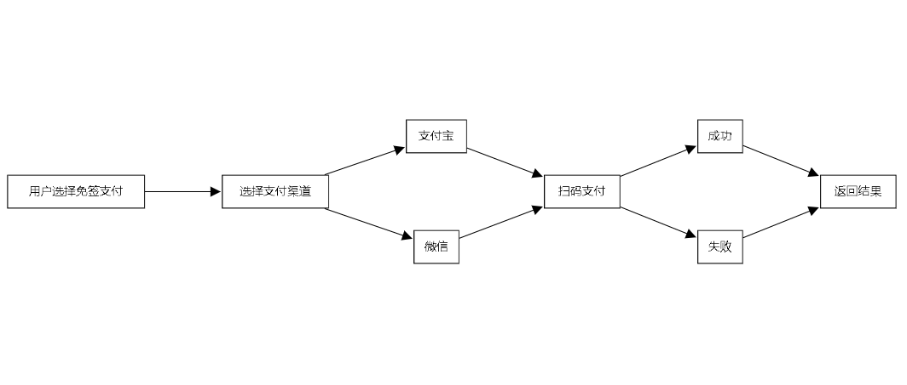

WHMCS VMQ 免签支付
=============================================================
Tags: whmcs-payment-vmq, WHMCS免签支付,支付宝免签,微信免签,免签支付

这个是个人开发者解决方案,针对WHMCS定制的
整个生态包含

    1. Web后端
    2. 监控APP
    3. WHMCS对接插件

>> 如果有开发需求或WHMCS定制类的产品可以联系哦       
>> 联系微信: base64_decode(d2FueWlncm91cA==)    

### 运行原理

流程

用户扫码付款 -> 收到款项后手机通知栏会有提醒 -> V免签监控端监听到提醒，推送至服务端 -> 发起回调告知WHMCS（或其它）支付成功

### 安装步骤
    
   1. VMQ WEB后端  [安装说明](vmq_backed)
   2. VMQ APP监控  [安装说明](vmq_app)
   3. WHMCS  插件  [安装说明](vmq_whmcs_plugin)

### 更新记录

* [2023/05/05] WHMCS插件更新多币种支持,解决回调的BUG
* [2023/05/05] VMQ后端的THINKPHP框架升级至最新版
* [2023/05/05] 兼容PHP 7.4的升级

### 特别说明
WHMCS插件原创开发，遵循 MIT License 开源协议发布      
其它均为开源软件，请遵守各自的授权License        
请勿用于非法用途        
